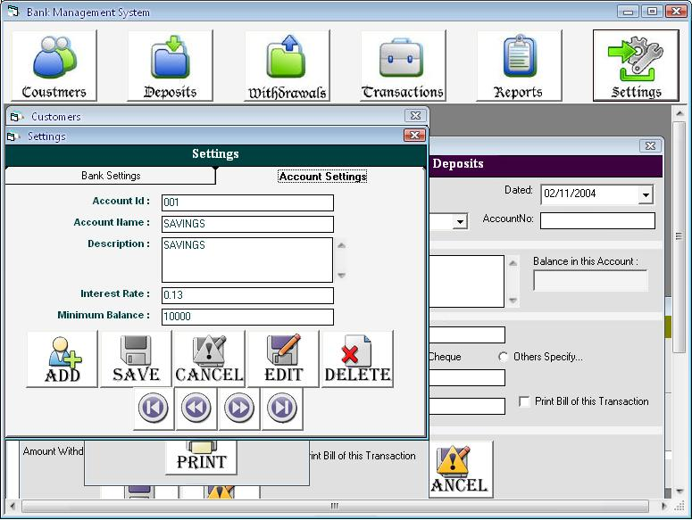



## Complete Bank Mangament System

### Description

A complete Bank Management system which uses data base whick keep tracks of coustomer details, deposits and withdrawals Transactions and settings (Bank and account settings). Reports can be generated on different basis.
 
### More Info
 

             |
---                |---
**Submitted On**   |2007-04-25 09:58:04
**By**             |[Y\. Jayarathina Madharasan](https://github.com/Planet-Source-Code/PSCIndex/blob/master/ByAuthor/y-jayarathina-madharasan.md)
**Level**          |Advanced
**User Rating**    |4.3 (13 globes from 3 users)
**Compatibility**  |VB 5\.0, VB 6\.0
**Category**       |[Complete Applications](https://github.com/Planet-Source-Code/PSCIndex/blob/master/ByCategory/complete-applications__1-27.md)
**World**          |[Visual Basic](https://github.com/Planet-Source-Code/PSCIndex/blob/master/ByWorld/visual-basic.md)
**Archive File**   |[Complete\_B2071046152007\.zip](https://github.com/Planet-Source-Code/y-jayarathina-madharasan-complete-bank-mangament-system__1-68826/archive/master.zip)

